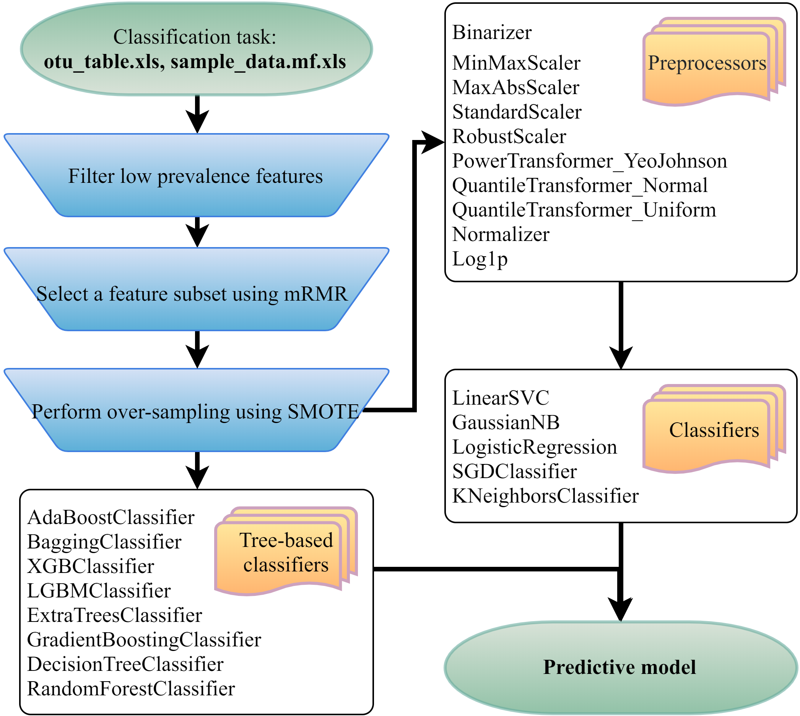
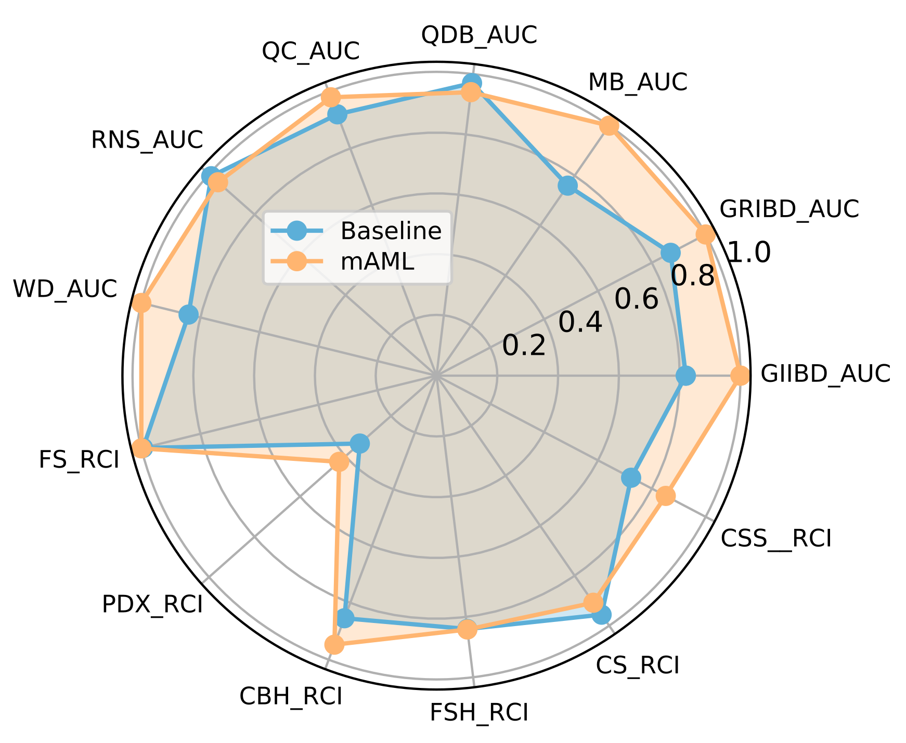
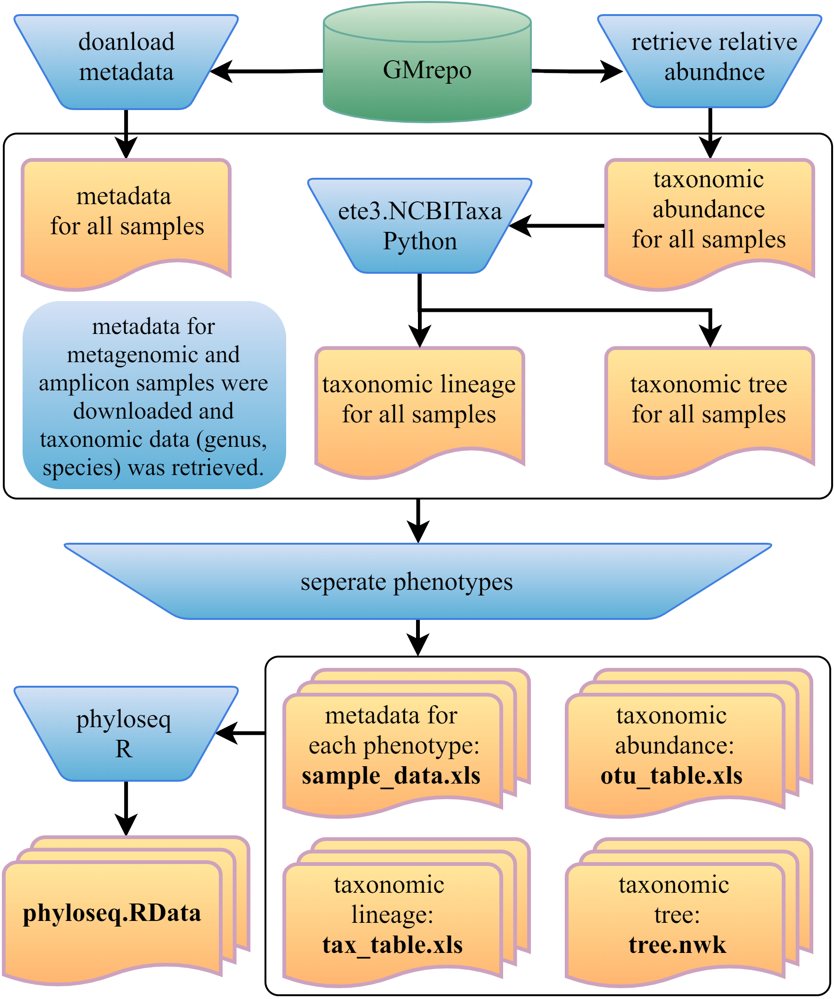
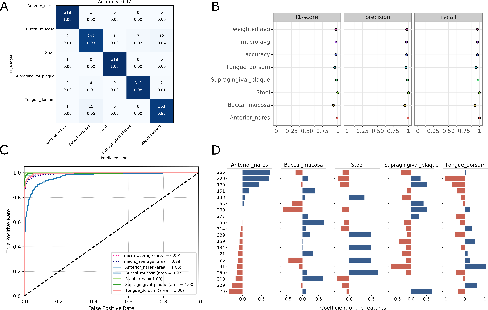

# mAML1.0

## mAML pipeline

Automated machine learning model building pipeline for microbiome data



Flowchart of the mAML pipeline. Two files indicated at the beginning of the pipeline should be submitted to the mAML web server. Operation steps before training are indicated in the blue inverse-trapezoids.


## mAML performance




Performance of mAML compared to [benchmark baselines](http://39.100.246.211:8050/Dataset). Labels are abbreviation of each dataset and the metrics used in original study


## GMrepo ML repository 



Framework of the [GMrepo ML](https://github.com/yangfenglong/mAML1.0/tree/master/datasets/GMrepo_datasets) repository construction. Operation steps are indicated in the blue inverse-trapezoids. Files with name in bold are all contained in the ML repository.

## Github repository Overview

```md
mAML1.0/
├── README.md
├── requirements.txt 	# requirements 
├── LICENSE 	# MIT License 
├── code/
│   ├── sklearn_pipeline.py 	# main script for the pipeline
│   ├── sklearn_pipeline_config.py 	# config file for changing classifiers with parameters grid and scalars 
│   └── utils.py 	# usefull functions
├── datasets            
│   ├── GMrepo_datasets/
│   │	├── GMrepo.ipynb # data download andd process ipython notebook (python)
│   │	├── amplicon.zip # amplicon datasets
│   │	├── metagenome.zip # metagenome datasets
│   │	├── phyloseq.ipynb # seperate phenotypes and generate phyloseq.Rdata (R)
│   │	└── ...
│   └── benchmark_datasets  # 18 benchmark datasets for testing the performance of mAML
└── results 	# benchmark results
    ├── Cho2012_Antibiotics_cecal.5
    ├── Cho2012_Antibiotics_cecal.5.csv_20191114034958.log
    ├── Cho2012_Antibiotics_fecal.5
    ├── Cho2012_Antibiotics_fecal.5.csv_20191114081356.log
    ...
    ├── Morgan2012_IBD.3.csv_20191114125857.log
    ├── Qin2012_Diabetes
    ├── Qin2012_Diabetes.csv_20191114130638.log
    ├── Qin2014_Cirrhosis
    ├── Qin2014_Cirrhosis.csv.20191122101417.log
    ├── Ravel2011_Vaginal
    ├── Ravel2011_Vaginal.csv_20191114132211.log
    ├── Wu2011_Diet
    ├── Wu2011_Diet.csv_20191114020330.log
    ├── Yang2010_EsophagitisPDX.4
    ├── Yang2010_EsophagitisPDX.4.csv_20191114132601.log
    └── work.sh 	# shell scripts for regenerating benchmark results 
```

## How to regenerate benchmark results

### 1. Clone this Github Repository

```
git clone https://github.com/yangfenglong/mAML1.0.git
cd mAML1.0
```

### 2. Install dependencies:

```
python version is 3.7.3.
pip3 install -r requirements.txt

git clone https://github.com/jundongl/scikit-feature.git 
# clone to your Python lib path to use MRMR feature selection method
# from skfeature.function.information_theoretical_based import MRMR
```

### 3. Usage of the pipeline:

```
usage: sklearn_pipeline.py --help or -h  

A pipeline for automatically identify the best performing combinations of scalars and classifiers for microbiomic data

positional arguments:
  X_file                feature matrix file (required)
  Y_file                map file (required)

optional arguments:
  -h, --help            show this help message and exit
  --outdir OUTDIR, -o OUTDIR
                        path to store analysis results, default='./'
  --prevalence PREVALENCE, -p PREVALENCE
                        filter low within-class prevalence features, default= 0.2
  --mrmr_n MRMR_N       number of features selected with MRMR, default=0
  --over_sampling       over-sampling with SMOTE
  --search              tune parameters of each classifier while selecting the best scaler and classifier
  --outer_cv OUTER_CV   number of fold in the outer loop of nested cross validation default=10
  --inner_cv INNER_CV   number of fold in the inner loop of nested cross validation, default=5
  --scoring SCORING     one of ['accuracy', 'average_precision', 'f1', 'f1_micro', 'f1_macro', 'f1_weighted', 'f1_samples', 'neg_log_loss', 'precision', 'recall', 'roc_auc'], default='accuracy'
  --n_jobs N_JOBS, -j N_JOBS
                        number of jobs to run in parallel, default= 1

Example:
    python  sklearn_pipeline.py Gevers2014_IBD_ileum.csv Gevers2014_IBD_ileum.mf.csv --mrmr_n 20 --over_sampling  --outdir ./ 

```

### 4. Examples of how to run mAML pipeline:

```
# Building a machine learning model for one dataset
python ../code/sklearn_pipeline.py \
	../datasets/Cho2012_Antibiotics_cecal.5/Cho2012_Antibiotics_cecal.5.csv \
	../datasets/Cho2012_Antibiotics_cecal.5/Cho2012_Antibiotics_cecal.5.mf.csv \
	--outdir Cho2012_Antibiotics_cecal.5  --search --over_sampling --mrmr_n 50 --n_jobs 4      
```

### 5. Visualization outputs of the pipeline


Visualizations for the best model of 'Huttenhower2012_HMP.BS.5' dataset: confusing matrix (A), ROC curve (B), classification report (C) and the top important features (D, default: top 20). In case of decision Tree based models, feature importances bar plot will be provided instead of feature’s coefficient plot.


You can alse simply upload your own feature data to our [mAML web-server](http://39.100.246.211:8050/Server) to automatically build a predictive model following the [tutorial](http://39.100.246.211:8050/Help).  


Any questions, contact me: yangfenglong110@126.com.
